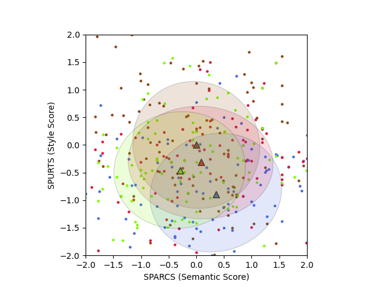

# SeMantic and linguistic UndeRstanding Fusion (SMURF)
[](#python) [](https://opensource.org/licenses/MIT)

Automatic caption evaluation metric described in the paper [SMURF: SeMantic and linguistic UndeRstanding Fusion for Caption Evaluation via Typicality Analysis](FILL SOON) (ACL 2021).

### Overview
SMURF is an automatic caption evaluation metric that combines a novel semantic evaluation algorithm (SPARCS) and novel fluency evaluation algorithms (SPURTS and MIMA) for both caption-level and system-level analysis. These evaluations were developed to be generalizable and as a result demonstrate a high correlation with human judgment across many relevant datasets. See paper for more details.

### Requirements
- torch>=1.0.0
- numpy
- nltk>=3.5.0
- pandas>=1.0.1
- matplotlib
- transformers>=3.0.0

### Usage

./smurf_example.py provides working examples of the following functions:

#### Caption-Level Scoring
Returns a dictionary with scores for semantic similarity between reference captions and candidate captions (SPARCS), style/diction quality of candidate text (SPURTS), grammar outlier penalty of candidate text (MIMA), and the fusion of these scores (SMURF).

#### System-Level Analysis
After reading in and standardizing caption-level scores, generates a plot that can be used to give an overall evaluation of captioner performances along with relevant system-level scores (intersection with reference captioner and total grammar outlier penalties) for each captioner. An example of such a plot is shown below:


The number of captioners you are comparing should be specified by when instantiating a smurf_system_analysis object. In order to generate the plot correctly, the captions fed into the caption-level scoring for each candidate captioner (C1, C2,...) should be organized in the following format with the C1 captioner as the ground truth: 

[C1 image 1 output, C2 image 1 output,..., C1 image 2 output, C2 image 2 output,...].

### Author:
Joshua Feinglass (https://scholar.google.com/citations?user=V2h3z7oAAAAJ&hl=en)

If you find this repo useful, please cite:
```
@inproceedings{feinglass2021smurf,
  title={SMURF: SeMantic and linguistic UndeRstanding Fusion for Caption Evaluation via Typicality Analysis},
  author={Joshua Feinglass and Yezhou Yang},
  booktitle={},
  year={2021},
  url={FILL SOON}
}
```